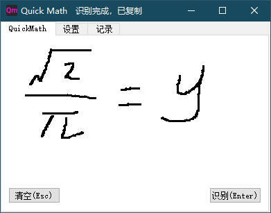
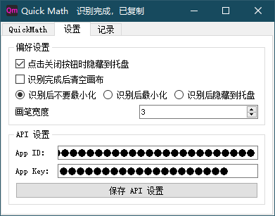

#   Quick Math

## 📝 介绍
顾名思义，Quick Math 是用于快速输入数学公式的一个工具。

在主界面是一个画板，你可以在上边用鼠标、触摸屏、手写笔写出数学公式，然后点击识别按钮或者按下回车键，你写的公式图片就会被上传到 Mathpix 识别，然后会自动复制返回的 Latex 公式。

它是开源的，你可以免费使用它。下载安装请到 [Github releases](https://github.com/HaujetZhao/QuickMath/releases) 或者  [Gitee releases](https://gitee.com/haujet/QuickMath/releases) 界面。

目前在两个仓库更新：

- https://github.com/HaujetZhao/QuickMath
- https://gitee.com/haujet/QuickMath

使用界面：

## 🔮 使用说明

首先本软件识别数学公式使用的是 Mathpix 在线服务的 API，所以你需要到 [Mathpix 官网](https://mathpix.com/ocr) 申请一个 Mathpix 账号，然后开通一个 OCR API 才行。

开通 API 需要绑定信用卡，支持银联，绑定的时候会扣费1美元。

Mathpix Api 的价格是：每个月前1000次免费，第 1-100K 次每次请求 0.004\$（约合人民币 0.028 元），第 100K-300K 次每次请求 0.002\$，第 300k 次这后每次请求 0.001​\$，如果超过了第1000次，自动从信用卡扣。你可以从官网页面看到这个月已经使用多少次。

申请完 API 后，回到软件在设置界面填入，就可以使用了。

在主界面是一个画板，你可以在上边用鼠标、触摸屏、手写笔写出数学公式，然后点击识别按钮或者按下回车键，你写的公式图片就会被上传到 Mathpix 识别，然后会自动复制返回的 Latex 公式。

## 🔨 参与贡献

作者只有 Win10 64 位系统。如果你用的是其它系统电脑，比如 windows 32 位、MacOS、Linux，你可以参与志愿打包。

只要安装上 requirements.txt 中的 python 依赖包，确保源码能跑起来，再用 pyinstaller 将 QuickHand.py 打包

再将：

- `misc` 文件夹
- `icon.ico` 文件
- `sponsor.jpg` 文件
- `style.css` 文件

都复制到打包出的 QuickMath 文件夹根目录，再打包成压缩包，即可。

Linux 和 MacOS 用户可能还需要将打包出的 QuickMath 文件夹根目录内的可执行文件加上执行权限才行，并且不能用 zip 等打包格式，因为这会使得可执行权限丢失。建议使用 tar.gz 格式压缩。

## ☕ 打赏

万水千山总是情，一块几块都是情。本软件完全开源，用爱发电，如果你愿意，可以以打赏的方式支持我一下：

## 😀 交流

如果有软件方面的反馈可以提交 issues，或者加入 QQ 群：[1146626791](https://qm.qq.com/cgi-bin/qm/qr?k=DgiFh5cclAElnELH4mOxqWUBxReyEVpm&jump_from=webapi) 

